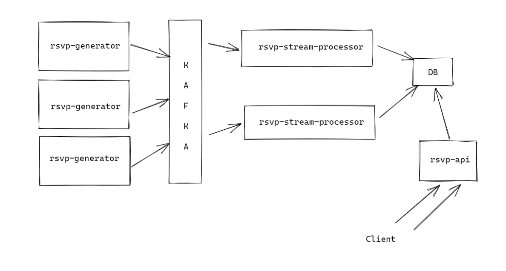
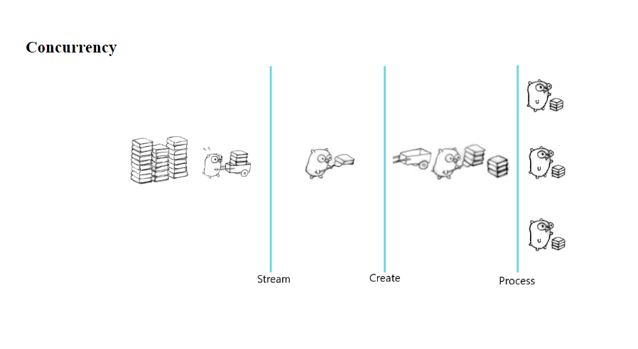
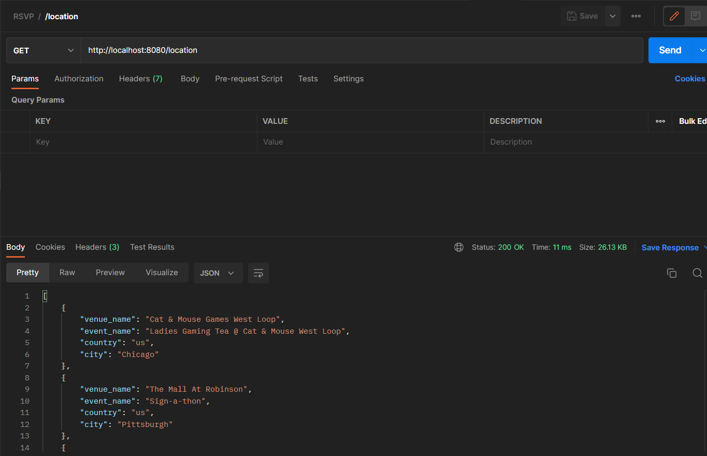

# rsvp-meetup

## Description
RSVP-Meetup Location Finder provides the endpoints to get the top trending meetup locations based on real-time processing of meetup RSVP feeds.
### _rsvp-meetup consists of following three microservices_
* **rsvp-generator** - for generating real-time rsvp feeds based on the provided meetup.json file
* **rsvp-stream-processor** - processes real-time feeds from rsvp generator, and stores processed result in db
* **rsvp-api** - provides endpoint to get the top trending locations for meetup.
## High level design



**Go concurrency processing**

## Installation
### Prerequisite
* Golang 1.19 and above
* Docker v20.10.14 and above.
* Extract all the _**“**.zip”**_ file from ./services-repo directory. 
* Each **service-repo** folder might include handler, config, stream and other supporting modules based on the scope of the service.
* To run every service from the hosted images, try running the **docker-compose.yaml** file from **../rsvp-meetup/**.

**Note**
* In case an **import error** arises, then run `go get` for the missing imports.
  `Eg: go get github.com/stretchr/testify `
* Above results were captured, using **windows** platform as my development environment.


## Execution
Run `docker-compose up` command to run the hosted docker images with the test suit.
```shell
Binoy@DESKTOP-PGVD8TN MINGW64 ~/GolandProjects/rsvp-meetup (main)
$ docker-compose up
[+] Running 7/6
 - Network rsvp-meetup_default                    Created                                                                                                                                  0.0s
 - Container rsvp-meetup-zookeeper-1              Created                                                                                                                                  0.1s
 - Container rsvp-meetup-db-1                     Created                                                                                                                                  0.1s
 - Container rsvp-meetup-rsvp-api-1               Created                                                                                                                                  0.1s
 - Container rsvp-meetup-kafka-1                  Created                                                                                                                                  0.1s
 - Container rsvp-meetup-rsvp-stream-processor-1  Created                                                                                                                                  0.0s
 - Container rsvp-meetup-rsvp-generator-1         Created                                                                                                                                  0.0s
Attaching to rsvp-meetup-db-1, rsvp-meetup-kafka-1, rsvp-meetup-rsvp-api-1, rsvp-meetup-rsvp-generator-1, rsvp-meetup-rsvp-stream-processor-1, rsvp-meetup-zookeeper-1
rsvp-meetup-zookeeper-1              | ZooKeeper JMX enabled by default
rsvp-meetup-zookeeper-1              | Using config: /conf/zoo.cfg
rsvp-meetup-rsvp-api-1               | 2023/02/08 02:02:54 starting the rsvp-api service
rsvp-meetup-db-1                     | {"t":{"$date":"2023-02-08T02:02:54.497+00:00"},"s":"I",  "c":"NETWORK",  "id":4915701, "ctx":"-","msg":"Initialized wire specification","attr":{"spec":{"
incomingExternalClient":{"minWireVersion":0,"maxWireVersion":17},"incomingInternalClient":{"minWireVersion":0,"maxWireVersion":17},"outgoing":{"minWireVersion":6,"maxWireVersion":17},"isInternalClient":true}}}
rsvp-meetup-db-1                     | {"t":{"$date":"2023-02-08T02:02:54.498+00:00"},"s":"I",  "c":"CONTROL",  "id":23285,   "ctx":"main","msg":"Automatically disabling TLS 1.0, to force-enable TLS 1.0 specify --sslDisabledProtocols 'none'"}
rsvp-meetup-db-1                     | {"t":{"$date":"2023-02-08T02:02:54.501+00:00"},"s":"I",  "c":"NETWORK",  "id":4648601, "ctx":"main","msg":"Implicit TCP FastOpen unavailable. If TCP FastOpen is required, set tcpFastOpenServer, tcpFastOpenClient, and tcpFastOpenQueueSize."}
```
Once all the services are up and running, use this [Postman](doc/RSVP.postman_collection.json) file to try the **/location** API endpoint.
### screenshots:


## Current Implementation
1. Providing results based on the real-time processing of meetup-rsvp feeds
2. API endpoint **/location** to get results based on top responses, guests and meetup-group activeness.
3. **rsvp-generator** service generates rsvp feeds based on the certain **dynamic** parameters. 
4. Using message queueing service(**Kafka**) to streamline the feeds for rsvp-stream-processor service.
5. **rsvp-stream-processor** takes care of **flattening** and **processing** of the data read from kafka server.
6. rsvp feeds are **batch** processed and the batch size can be configurable.
7. With the help of **goroutine** each batch of rsvp feeds are processed **concurrently**. 
8. **Cleaning** of stale batch records from the db after processing it. 
9. **Strict** error and idempotence based http methods usage.
10. Dedicated db **indexing** for the faster result retrieval.

## Improvements
1. Alternatively, **rsvp-stream-processor** service can be replaced with Apache Spark streaming tool.
2. Increasing the performance by profiling on the resource operations, using **go pprof** tool.
3. Adding more api endpoints filters to provide results based on the user **location**, **distance**, **groups** etc..
4. Adding more error handling, testcases to the entire flow of the processing.

## Contact
For any discussion or feedback, please free to reach me over
[LinkedIn](https://www.linkedin.com/in/sudhakar-padmanaban-b2047588/) , [Mail](sudhakarpadmanaban14@gmail.com).
